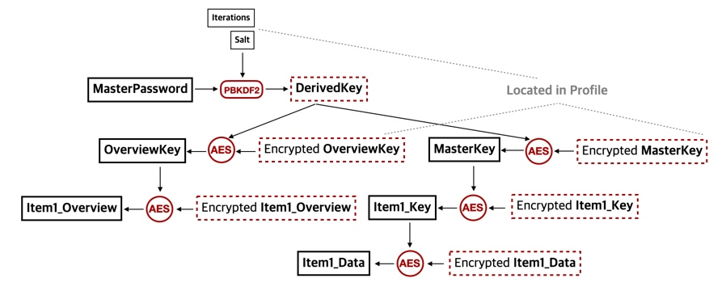

# 1Password OPVault 解锁过程的实现

## tl; dr

1. 定位 `OnePassword.sqlite`. 通常在

    ```bash
    ~/Library/Group Container/2BUA8C4S2C.com.agilebits/Library/Application Support/1Password/Data/`
    ```

2. 测试脚本是否可以解锁

    ```bash
    python unlockOpVaultSqlite.py -p <path to OnePassword.sqlite> -n <number of items to reveal>
    ```

`-p` 默认值为(1)中的路径，`-n`的默认值为5.

## 概览

1Password 自版本7后有两种用法：

1. 用户由 iClouc/Dropbox 同步数据，或仅在本地保管数据
2. 订阅后，由1P官方服务在所有设备间同步数据。

总的来说，1Password 的密钥管理是分层级的。每次读取数据时，用户由自己掌握的 secret (Master password and/or Secret Key)
生成出一个密钥，再由该密钥解锁下层密钥，最后解锁用户保存在Vault里的数据。如果自己同步数据，则数据按照 [OPVault][OPVault Design]
标准存放。使用订阅功能，则数据由官方服务器在各设备间同步。其标准由 [1Password whitepaper][whitepaper] 描述。

存储数据的媒介有三种（Windows中可能有所不同）：

1. `B5.sqlite`: 用于和1P官方服务器同步
2. `OnePassword.sqlite`: 用于本机保存
3. `band_<x>.js` + `profile.js` + others: 将(2)中的数据同步到 iCloud/Dropbox（或用户自己的硬盘）中使用。

(2)，(3)所描述的数据是等价的，但和(1)有很大区别。(1)中的数据需要由2SKD (同时用 master password 和 secret key) 解锁，而(2),(3)只需要 master password 就可解锁。

可通过以下方式得到(3)中的文件：

1. Preferences -> Advanced -> ✅ "Allow Creation of vaults outside of 1Password accounts" 
2. Preference -> Sync 选择同步位置为本地。

## 正文

这里我们用 Python 来复现由 Master Password 解锁整个 OPVault 的过程。因为 Python 标准库支持 `sqlite3`, 
因此选择 `OnePassword.sqlite` 作为切入点。对于 `profile.js`+ `band_<x>.js` 的文件，经测试可以同样解锁。详情见代码。

需要的密码学算法有三个，分别承担了密钥推导、对称加密、数据校验的功能：

1. PBKDF2-HMAC-SHA512: 用于由 Master Password 推导出两个密钥 (derivedKey.cryptoKey, derivedKey.hmacKey)，该密钥用作加密/解密及校验存储在 `profile` 中的 `master_key` 和 `overview_key`.
2. HMAC-SHA256: 用于1. 中提到的校验。
3. AES256CBC: 用于对称加密所有需要加密的数据，包括用户数据和需要存储的密钥。

整个解锁过程总结如下：

1. 用户输入master password, 用 PBKDF2-HMAC-SHA512 生成导出密钥 (`derivedKey.cryptoKey`, `derivedKey.hmacKey`)。用到的参数除 master password 外还有 `profile` 中的 `salt` 和 `iterations`.
2. 用 (`derivedKey.cryptoKey`, `derivedKey.hmacKey`) 对 profile 中（加密后的） `master_key` 和 `overview_key` 解密和校验，得到 (`masterKey.cryptoKey`, `masterKey.hmacKey`) 以及 (`overviewKey.cryptoKey`, `overviewKey.hmacKey`).
3. 如果 (2) 的校验成功，则说明(1)中生成的密钥正确，且存储`master_key`, `overview_key`的数据未被篡改，此时可以看作 Vault 已被解锁。
4. 若想得到某个 item 的 overview (包含title, website等低安全等级的信息)， 则只需用 (`overviewKey.cryptoKey`, `overviewKey.hmacKey`) 解密/校验。
5. 若想得到某个 item 实质的数据 (包含password, username等高安全等级的信息)，则还需由 (`masterKey.cryptoKey`, `masterKey.hmacKey`)
解密/校验与该 item 对应的 (`itemKey.cryptoKey, itemKey.hmacKey`), 然后再解密/校验 item 数据本身。

注意：首先，每一个 item 都有一个与之对应的 key. 这些 keys 是用户首次使用1P时在本地随机生成的。此后会被加密且不再改变。按照官方解释，之所以不用一个 key 加密所有的 item 是因为不希望 一个 key 加密太多信息。其次，之所以不用 `derivedKey` 来加密 `itemKey` 是为了方便用户修改密码。用户改变 master password 时，只需要解密再重新加密 `master key` 便可, 否则则需要对所有的 `itemKey` 解密再重新加密。

上述过程总结为下图。


下面是从 Master Password 推导密钥的函数。这里推导出来的 Key 是 64 Byte 长， 前一半用作加密，后一半用作HMAC校验。
之后的 key 的结构也是一样。

```python
from Crypto.Protocol import KDF

erivedKeys = namedtuple("DerivedKeys", ("cryptoKey", "hmacKey"))
def derive_keys(masterPassoword: str, salt:bytes, iterations:int) -> DerivedKeys:
    # encode master password as a utf-8 null terminated string.
    mp = (masterPassoword + '\0').encode('utf-8')
    # decode the salt into bytes
    dk = KDF.PBKDF2(
        password=mp,
        salt=salt,
        dkLen=64,
        count=iterations,
        prf=hmac_sha512)

    return DerivedKeys(cryptoKey=dk[0:32], hmacKey=dk[32:])
```

完成上一步的密钥推导后，我们就可以进行对 `MasterKey` 的校验和解锁了。`MasterKey` 由 [opdata][opdata] 格式存放。
其最后的 32 Byte 是 HMAC 校验码。OPVault的数据采用的是 encrypted-then-MAC. 因此在解密前，我们可以先进行HMAC校验。
如果校验成功，且数据未被篡改，则可以证明我们上一步的密钥推导是正确的。一旦这个正确性得到了验证，我们就一定可以解锁vault中的
所有内容。下面的代码中有详细的注解。

```python
import struct
from Crypto.Cipher import AES

def decrypt_masterkey(keydata: bytes, derivedKey: DerivedKey):
    """
    see https://support.1password.com/opvault-design/#opdata01 for details.
    In a opdata entry, the first 8 bytes are always b"opdata01".
    The next 8 bytes form a unsinged int64 to indicate the length of the plaintext in bytes.
    The next 16 bytes form initialization vector (IV) for AES256 CBC encryption via the cryptoKey.
    The last 32 bytes form the hmac code.
    The rest bytes in the middle form the ciphertext. But notice the after decrypting the ciphertext,
    the plaintext obtained is longer than the length indicated by the second 8 bytes. This is because
    some random bytes are prepended for more security.
    """

    header = keydata[0:8]
    assert header == b'opdata01'

    length = struct.unpack('<Q', keydata[8:16])[0]  # the length of the substantial plaintext
    IV = keydata[16:32]
    mac = keydata[-32:]
    # here we first autheticate the MAC code.
    # If it fails, then either the derived key is incorrect, or the data is tampered.
    computed_mac = hmac_sha256(hmacKey, keydata[0:-32])
    if mac != computed_mac:
        raise ValueError("HMAC authetication failed. Either key is incorrect or data is tampered.")

    # After this line, we have full access of the vault.

    # decrypt
    ciphertext = keydata[32:-32]
    cipher = AES.new(cryptoKey, AES.MODE_CBC, IV=IV)
    plaintext = cipher.decrypt(ciphertext)

    # remove the random prepending
    return plaintext[-length:]
```

其他的内容解锁方式类似。

[OPVault Design]: https://support.1password.com/opvault-design/
[OPVault Directory Layout]: https://support.1password.com/opvault-design/#directory-layout
[opdata]: https://support.1password.com/opvault-design/#opdata01
[whitepaper]: https://1password.com/files/1Password-White-Paper.pdf